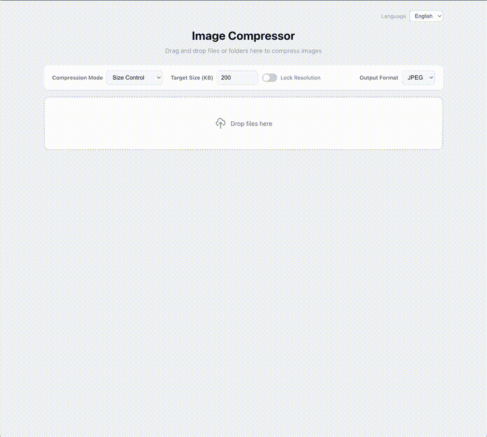

# 图片压缩工具

基于浏览器的图片压缩工具，使用 React + TypeScript + Vite 构建。支持拖放、批量处理、质量/大小控制，以及多语言界面。

> 在线体验：[nervtech.github.io/browser-image-compressor](https://nervtech.github.io/browser-image-compressor/)

> [English](../README.md) | [日本語](README.ja.md)

## 演示



## 功能特性

- **拖放上传** — 直接将图片或文件夹拖放到页面上
- **两种压缩模式** — 质量控制（滑块）或目标文件大小（KB）
- **锁定分辨率** — 可选择保留原始图片尺寸
- **批量处理** — 4 个并发处理器同时压缩多张图片
- **实时预览** — 缩略图卡片，显示压缩率标签
- **输出格式** — JPEG、WebP、PNG
- **多语言** — English、中文、日本語（自动检测浏览器语言）

## 快速开始

```bash
npm install
npm run dev
```

在浏览器中打开 http://localhost:5173 。

## 构建生产版本

```bash
npm run build
```

输出目录为 `dist/`，可使用任意静态文件服务器托管：

```bash
npx serve dist
```

### 部署到 GitHub Pages

1. 将仓库推送到 GitHub
2. 进入 Settings → Pages → Source 选择 GitHub Actions，或将分支设为 `main` 目录设为 `/docs`
3. 如果手动部署：本地构建后将 `dist/` 推送到 `gh-pages` 分支

## 使用说明

1. 在浏览器中打开应用
2. 在工具栏中配置压缩参数
3. 将图片或文件夹拖放到拖放区域
4. 点击 **压缩图片** 处理所有文件
5. 单独下载每个文件，或打包下载 ZIP

## 项目结构

```
src/
  i18n/           — 多语言上下文和翻译字典
  utils/          — 图片处理、ZIP 创建
  App.tsx         — 主应用组件
  App.css         — 样式
  main.tsx        — 入口文件
docs/             — 多语言文档
```

## 技术栈

- React 19 + TypeScript
- Vite 8
- JSZip 用于 ZIP 打包

## 许可证

MIT
